# ai-studio 시연 사용설명서 (상세판)

> **버전:** v2.3.0 · **작성:** 2026-05-18
> **URL:** https://ai-studio-drab-nine.vercel.app

---

## 데모 계정

| 역할 | 이메일 | 비밀번호 | 진입 화면 |
|---|---|---|---|
| 수강생 | `demo-student@ai-studio.kr` | `rlarudtn2!` | `/dashboard` |
| 강사 | `demo-instructor@ai-studio.kr` | `rlarudtn2!` | `/instructor/dashboard` |
| 운영자 | `demo-ops@ai-studio.kr` | `rlarudtn2!` | `/operations/dashboard` |

> 로그인은 기본 매직 링크 모드. **"→ 비밀번호로 로그인"** 토글 후 진행.
> 운영자 계정은 시연 편의를 위해 admin 권한으로 설정되어 있습니다.

---

# A. 공통 (비로그인)

## A-1. 메인 (`/`)
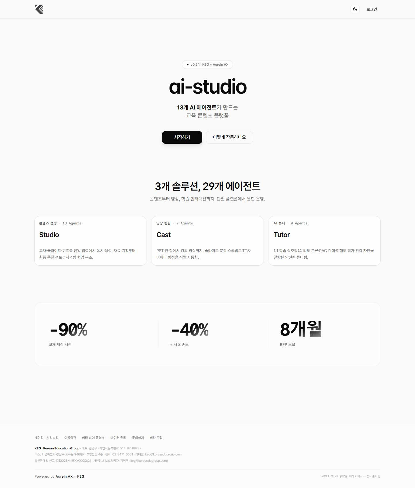

**구성 요소**
- **히어로 섹션** — "콘텐츠부터 영상, 학습 인터랙션까지" 메시지 + CTA
- **3대 솔루션 카드** — Studio / Cast / Tutor 각각 클릭 시 해당 페이지
- **상단 네비** — 로그인/회원가입 버튼

**기능 포인트**
- 비로그인 사용자의 첫 진입점. 가치 제안 5초 안에 전달.
- 우측 상단 다크 모드 토글 (전체 페이지 공통).

---

## A-2. 로그인 (`/login`)
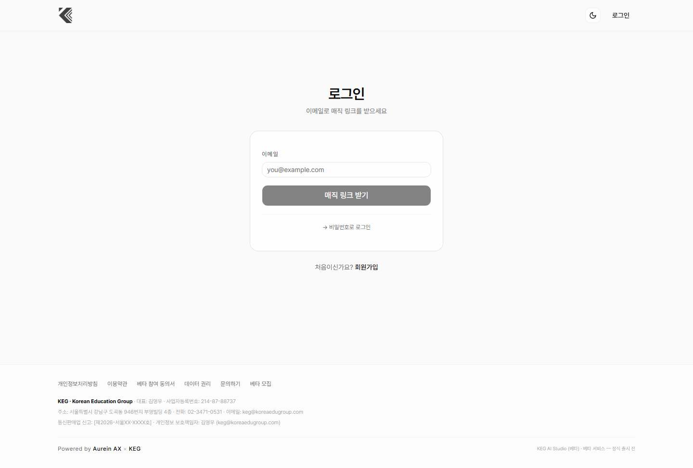

**메뉴 / 입력**
- 이메일 입력 → **매직 링크 받기** (기본 모드)
- 하단 토글 → **비밀번호로 로그인** 전환
- "처음이신가요? 회원가입" 링크 → `/signup`

**기능 포인트**
- 매직 링크: Resend로 1회용 인증 메일 발송 (15분 유효).
- 비밀번호 로그인: Supabase Auth + IP 기반 brute-force 방어 (15분당 5회).
- 로그인 성공 → `profiles.role`에 따라 자동 라우팅:
  - `user` → `/dashboard` / `instructor` → `/instructor/dashboard` / `admin` → `/admin` / `operations` → `/operations/dashboard` / `keg_super_admin` → `/super-admin`.

---

## A-3. 회원가입 (`/signup`)
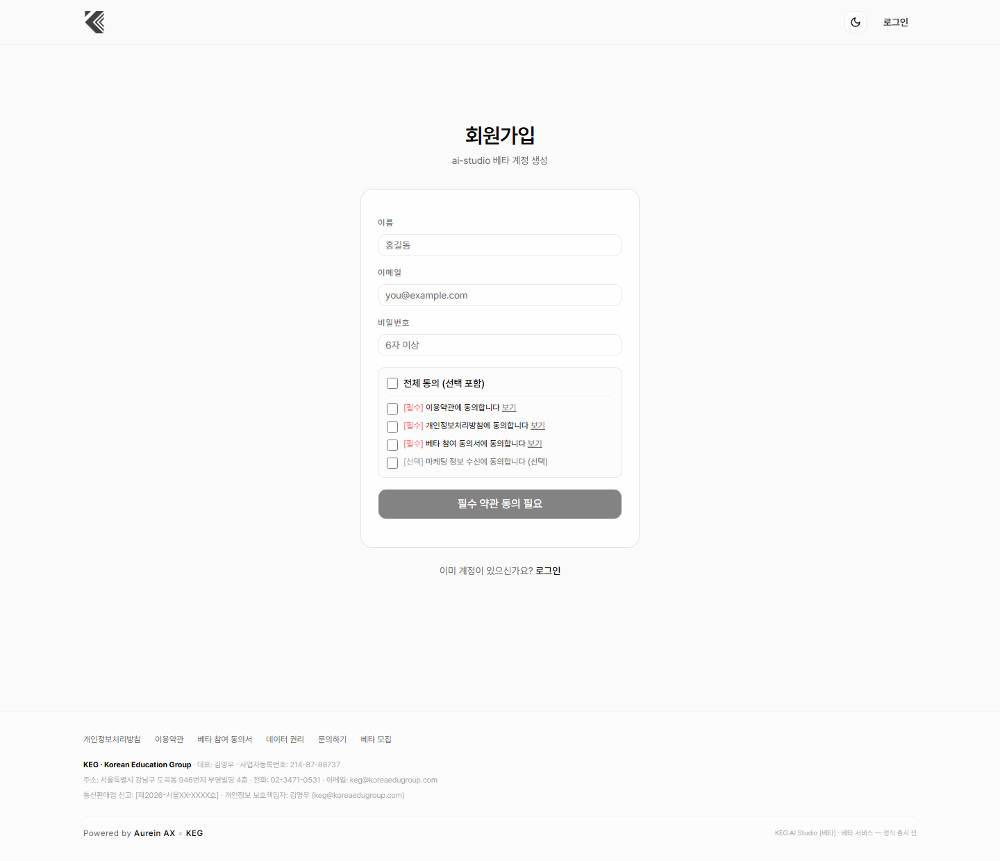

**입력 항목**
- 이메일, 비밀번호 (최소 8자)
- 이름 (선택)
- 약관 동의 체크박스

**기능 포인트**
- Supabase Auth 직접 호출. 가입 즉시 `profiles` row 자동 생성 (트리거).
- 이메일 인증 토글 가능 (현재 데모는 자동 confirm).

---

## A-4. 요금제 (`/pricing`)
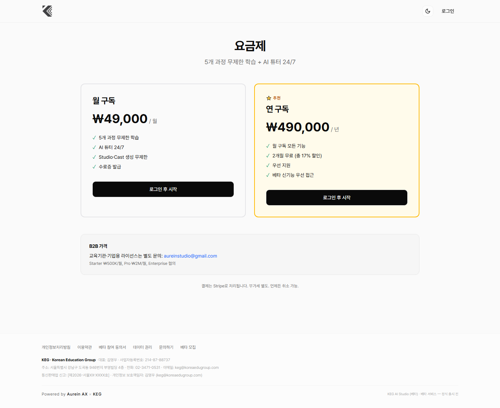

**플랜**
- **Free** — 월 3건 Studio · 1건 Cast
- **Starter** — 월 30건 / 10건
- **Pro** — 월 무제한 / 50건 + RAG
- **Enterprise** — 별도 협의 (멀티 테넌트 + SSO)

**기능 포인트**
- Stripe 연동 → "구독" 버튼 클릭 시 Checkout Session 생성.
- 데모 환경은 테스트 모드 Stripe key 사용.

---

## A-5. 블로그 (`/blog`)
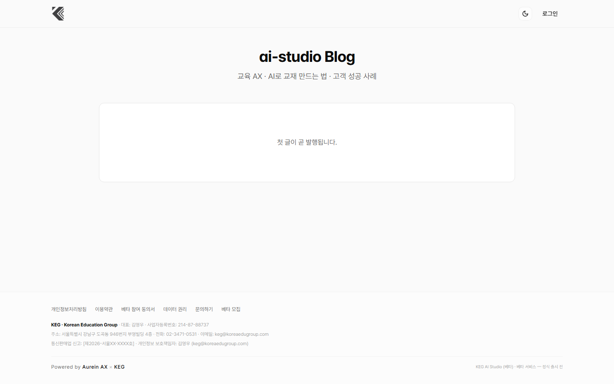

**구성**
- 발행된 `blog_posts`(slug, published=true) 카드 리스트
- 카테고리 필터 (제품 / 교육 인사이트 / 케이스 스터디)

**기능 포인트**
- 마케팅 SEO 채널. 작성은 `/admin/marketing` 또는 `/admin/press`에서.

---

# B. 수강생 (`demo-student@ai-studio.kr`)

## B-1. 대시보드 (`/dashboard`)
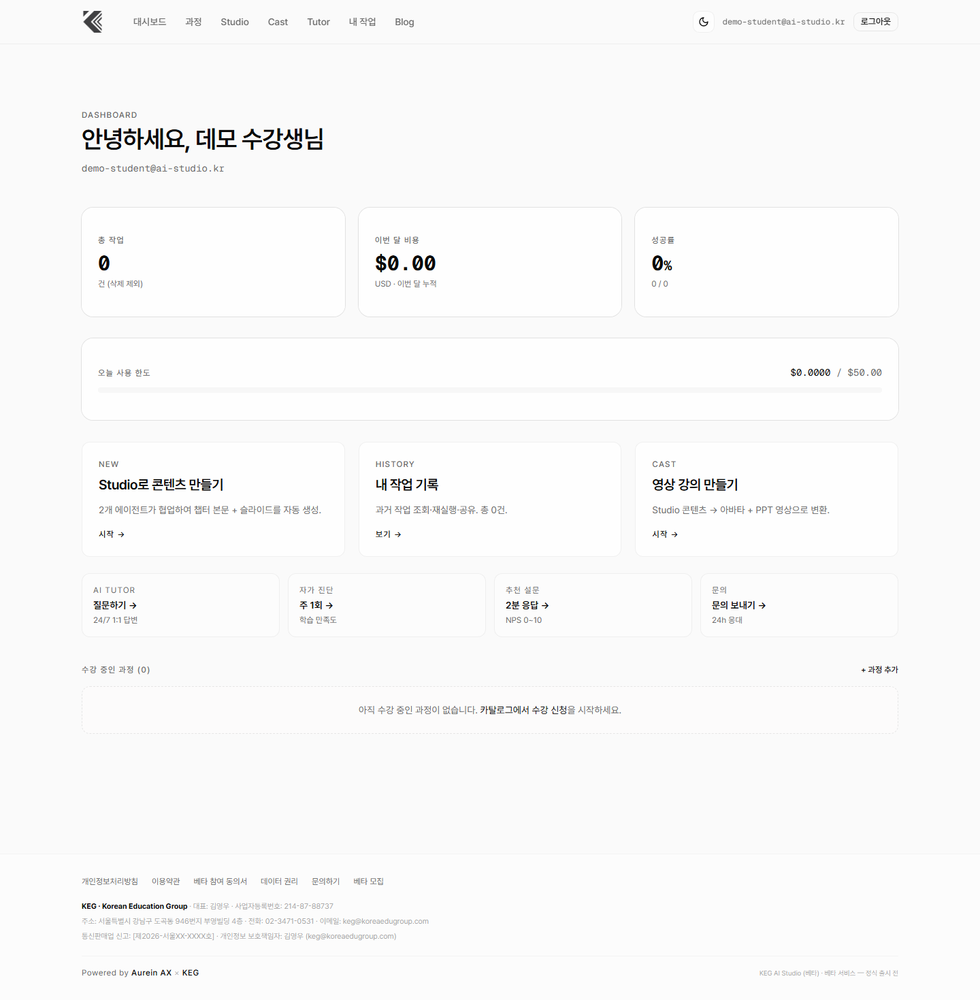

**섹션별**
1. **상단 인사 + 진행 중인 학습** — 최근 활동 코스 카드 (이어서 학습 버튼)
2. **이번 주 학습 목표** — 완료 / 미완료 체크리스트
3. **알림** — 강사 메시지, 신규 코스, 수료 임박
4. **추천 코스** — 학습 이력 기반 추천 (course_category 매칭)

**기능 포인트**
- Server Component + `cache()` — 페이지당 Supabase 호출 최소화.
- 모든 카드 클릭은 학습 페이지로 직결 (불필요한 중간 단계 제거).

---

## B-2. AI 튜터 (`/tutor`)
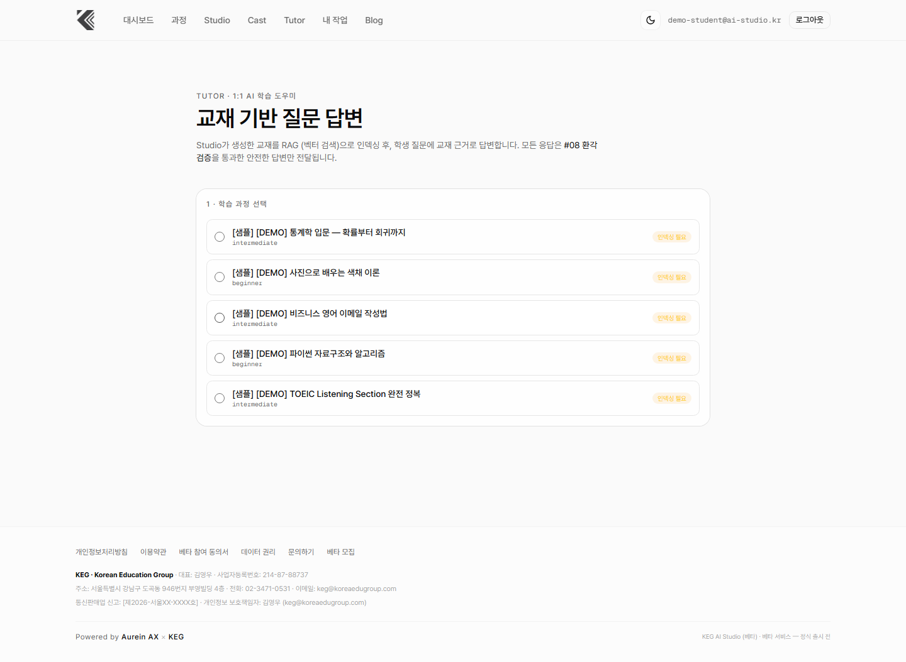

**메뉴**
- 좌측: 대화 목록 (`tutor_conversations` 기록)
- 우측: 채팅 입력 + 메시지 스트림
- 상단: 현재 학습 코스 선택 드롭다운

**기능 포인트**
- **9개 에이전트 4팀 협업** (Intent → RAG Retrieve → Answer → Eval)
- 코스 자료를 RAG로 인용 → 답변 하단에 출처 표시
- **이해도 자동 측정** — 답변 후 학생 응답 분석 → 점수 산출
- 이해도 < 임계치(50%) 시 `admin_alerts`에 자동 기록 → 운영자 알림
- 대화 종료 시 학습 요약 자동 생성 (`tutor_understanding_alerts`)

---

## B-3. 수강 가능 코스 (`/courses`)
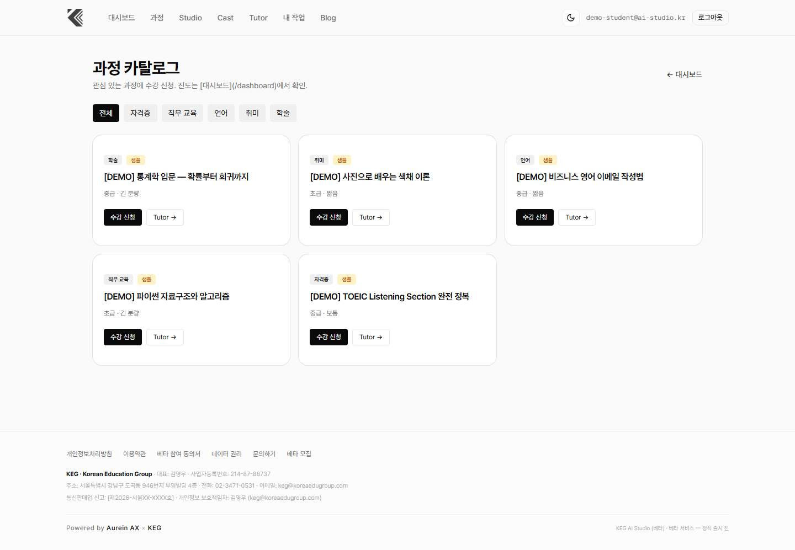

**메뉴**
- 카테고리 필터: 전체 / 자격증 / 직무 교육 / 언어 / 취미 / 학술
- 코스 카드 — 제목, 난이도, 분량, 강사
- "수강 신청" 버튼 → `student_enrollments` 행 생성

**기능 포인트**
- `studio_jobs` 중 `is_sample=true` + `status='completed'`만 노출.
- 등록 후 즉시 `/dashboard`에 진행 중 코스로 추가됨.

---

## B-4. 학습 샘플 (`/samples`)
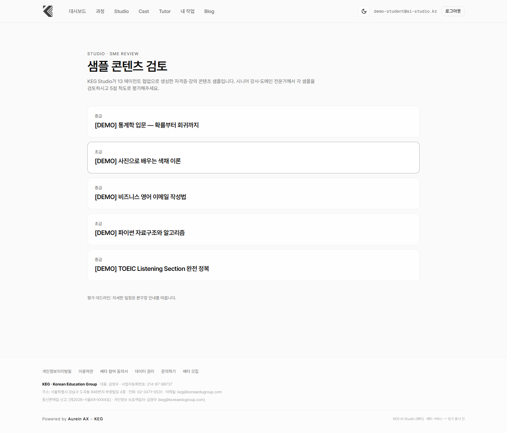

**구성**
- SME 평가 통과한 샘플 콘텐츠 (3축 평가 정확성·완전성·일관성)
- "이 콘텐츠 학습하기" 버튼 → 튜터 시작

**기능 포인트**
- 신규 사용자가 가입 즉시 체험할 수 있는 무료 콘텐츠.
- 컨버전 퍼널의 핵심 — 샘플 → 유료 코스 전환율 추적.

---

## B-5. 문의 (`/support`)
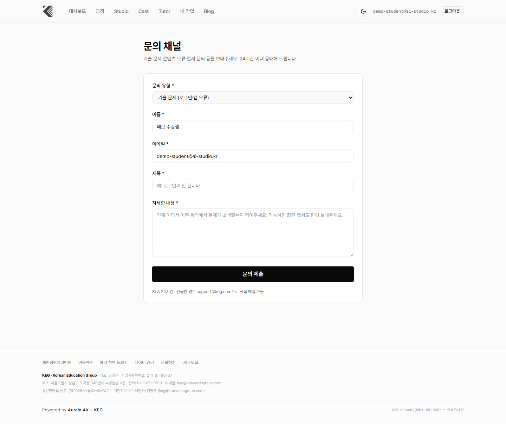

**입력**
- 카테고리: 기술 문제 / 콘텐츠 오류 / 결제 / 기타
- 제목, 본문 (Markdown 지원)
- 첨부 파일 (선택)

**기능 포인트**
- 제출 시 `support_tickets` 행 생성 + 운영자에 이메일 자동 발송 (Resend).
- 학습자는 본인 티켓만 조회 가능 (RLS 정책).

---

## B-6. 온보딩 (`/onboarding`)
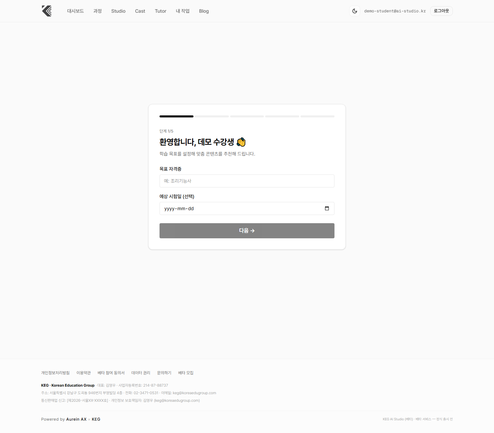

**5단계 흐름**
1. 학습 목표 설정 (자격증 / 취미 / 직무 / 학술)
2. 관심 카테고리 선택 (다중)
3. 학습 가능 시간대
4. 알림 채널 (이메일 / 브라우저 푸시)
5. 약관 + 개인정보 동의 → `consent_log`

**기능 포인트**
- 가입 직후 첫 진입 시 자동 표시. 완료하면 `profiles.onboarding_state='completed'`.
- 미완료 사용자는 대시보드 진입 시도 시 자동으로 리디렉트.

---

# C. 강사 (`demo-instructor@ai-studio.kr`)

## C-1. 강사 대시보드 (`/instructor/dashboard`)
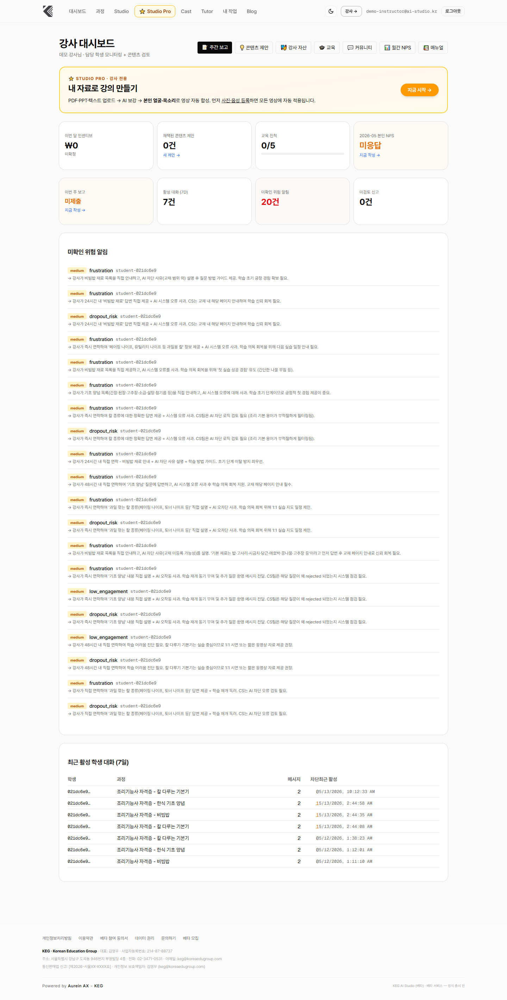

**위젯**
- **상단 KPI 4종** — 강의 수 / 수강생 수 / 매출 / NPS
- **이번 주 알림** — 콘텐츠 제안 승인 대기, SME 검수 요청, 인센티브 정산
- **최근 학생 대화 (7일)** — 튜터 대화 요약
- **활동 로그** — 최근 본인 작업 (Studio/Cast/Studio Pro)

**기능 포인트**
- 매출 위젯 → Stripe + `instructor_incentives` 조인 결과.
- 학생 활동 → `tutor_conversations` 강사 권한 RLS 조회.

---

## C-2. Studio (`/studio`)
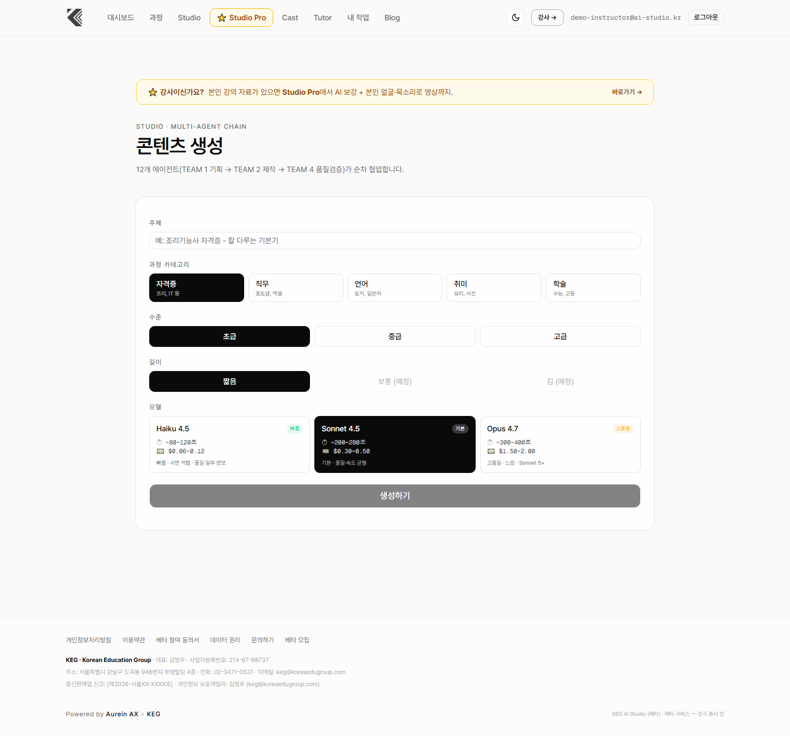

**입력 폼**
- 주제 (자유 텍스트, 한 줄)
- 카테고리 (certification / professional / language / hobby / academic)
- 난이도 (beginner / intermediate / advanced)
- 분량 (short ~30분 / medium 1~2시간 / long 8시간+)
- 모델 선택 (gpt-4o / claude-sonnet-4-6 / claude-opus-4-7)

**기능 포인트 — 13개 에이전트 4팀 협업**
1. **TEAM 1 입력 검증** — 주제 적합성, 표절, 정책 검수
2. **TEAM 2 콘텐츠 생성** — Book(목차→본문) / Slide / Quiz 병렬 생성
3. **TEAM 3 오케스트레이션** — 팀 간 일관성 조정, 형식 변환
4. **TEAM 4 SME 평가** — 정확성 · 완전성 · 일관성 3축 점수 (각 0-10)

- 모든 호출 비용 `cost_log`에 기록 → `/admin/monitoring`에서 집계.
- 작업 실패 시 `studio_jobs.agent_logs`에 단계별 에러 저장.

---

## C-3. Cast (`/cast`)
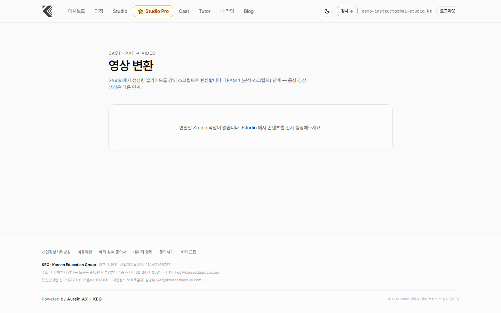

**입력**
- PPTX 파일 업로드 (`studio-pptx` 버킷)
- 보이스 선택 (사전 등록된 강사 보이스 또는 기본 TTS)
- 자막 언어 (한국어 / 영어 / 일본어)

**기능 포인트 — 7개 에이전트 4팀 파이프라인**
1. **PPT 파싱** — 슬라이드별 텍스트/노트 추출
2. **스크립트 생성** — 슬라이드 발표용 자연어 변환
3. **TTS 변환** — Anthropic / ElevenLabs / OpenAI
4. **HeyGen 영상 합성** — 아바타 + 음성 결합
5. **자막 생성** — Whisper 기반 SRT
6. **품질 평가** — 음성 끊김, 발음 정확도 등
7. **번들링** — 영상 + 자막 + 슬라이드 이미지 → 다운로드 패키지

- 산출물 버킷: `cast-video`, `cast-audio`, `cast-captions`, `cast-slide-images`
- 처리 시간: 슬라이드 10장 기준 약 3-5분
- 비용: 슬라이드당 평균 $0.30 (HeyGen $0.20 + TTS $0.05 + LLM $0.05)

---

## C-4. Studio Pro (`/studio-pro`)
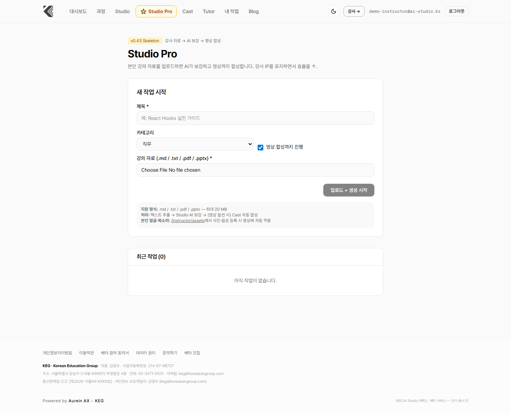

**개요**
- 강사 본인의 강의 자료(PDF / PPT / 음성 녹음) 업로드
- → RAG 임베딩 → 강사 스타일에 맞춘 코스 자동 생성

**워크플로**
1. 자료 업로드 (`studio-pro-uploads`, `instructor-voices`)
2. 강사 스타일 분석 (말투, 강의 구조, 강조 패턴)
3. RAG 인덱싱 → `rag_embeddings` (pgvector)
4. 새 주제 입력 시 강사 스타일 적용해 콘텐츠 생성
5. 결과물: `studio_pro_jobs`에 기록 + `/studio` 결과와 동일한 다운로드

**기능 포인트**
- 강사 보이스 1회 등록(5분 녹음)으로 모든 Cast 작업에 본인 음성 자동 적용.
- Phase 4 핵심 차별화 기능 — 콘텐츠 제작 외주 비용 절감.

---

## C-5. 강사 자산 (`/instructor/assets`)
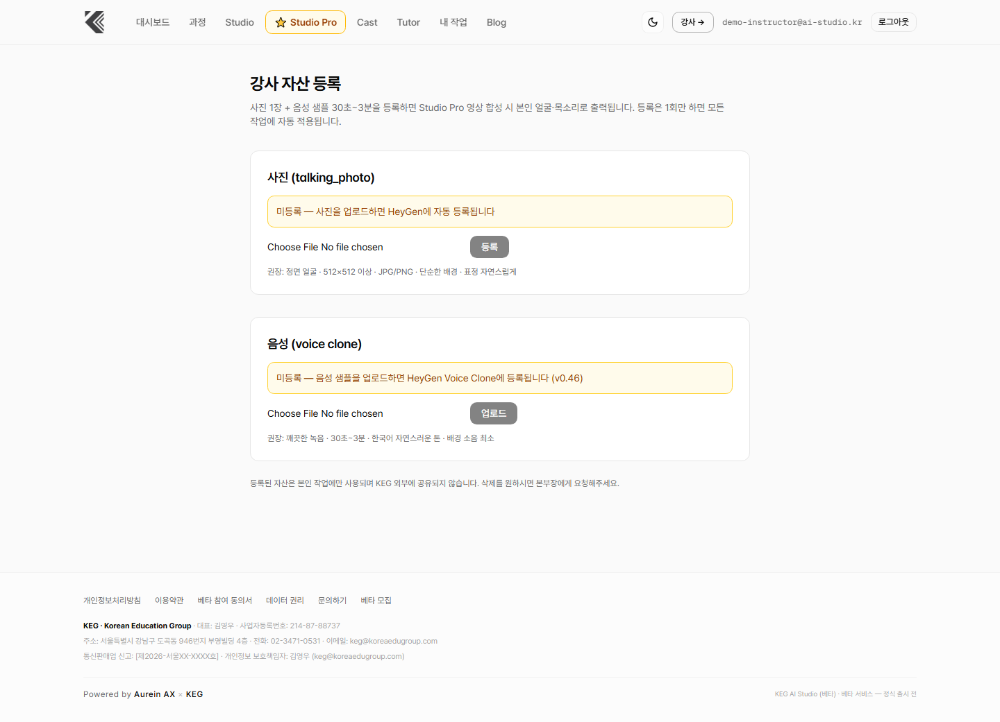

**자산 종류**
- **사진** (`instructor-photos`) — 강사 프로필 / 코스 썸네일
- **음성** (`instructor-voices`) — Cast TTS용 5분 녹음
- **PDF/PPT** (`studio-pro-uploads`) — 기존 강의 자료

**메뉴**
- 자산 업로드 / 미리보기 / 메타데이터 편집 / 삭제
- 자산별 사용 위치 표시 (어느 코스/Cast 작업에 쓰였는지)

---

## C-6. 콘텐츠 제안 (`/instructor/proposals`)
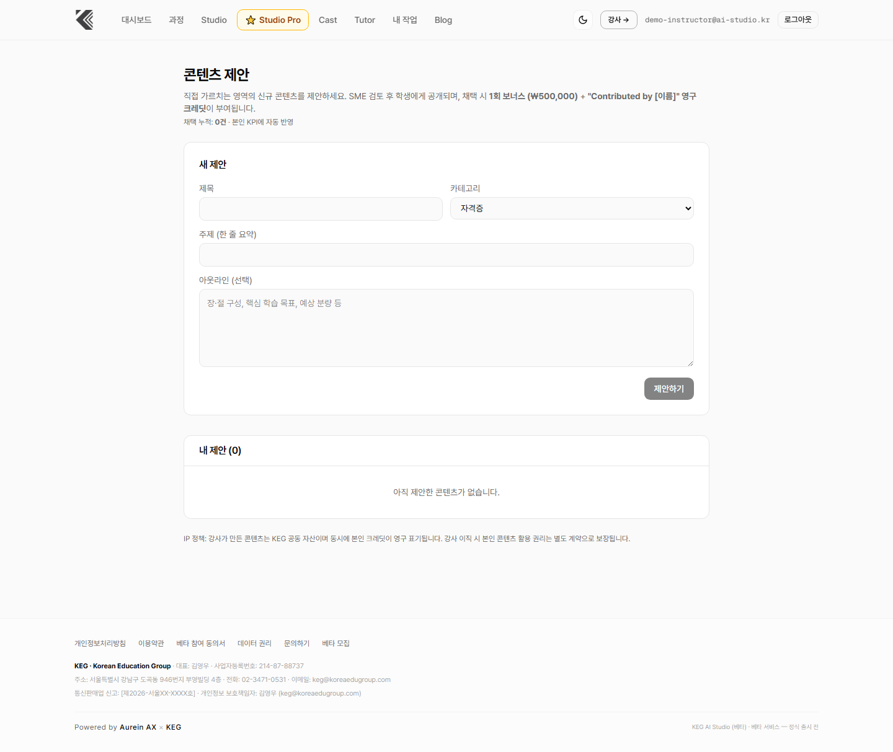

**개요**
- 강사가 신규 코스 주제를 제안 → 관리자 승인 시 Studio로 제작 진행
- 제안 상태: draft / submitted / under_review / approved / rejected

**입력**
- 코스 제목, 카테고리, 대상 학습자 규모(예상)
- 시장 분석 (선택) — 경쟁사 / 차별점

**기능 포인트**
- `instructor_content_proposals` 테이블 — 검토 흐름 추적
- 승인 시 자동으로 Studio 작업 큐에 추가

---

## C-7. 강사 NPS (`/instructor/nps`)
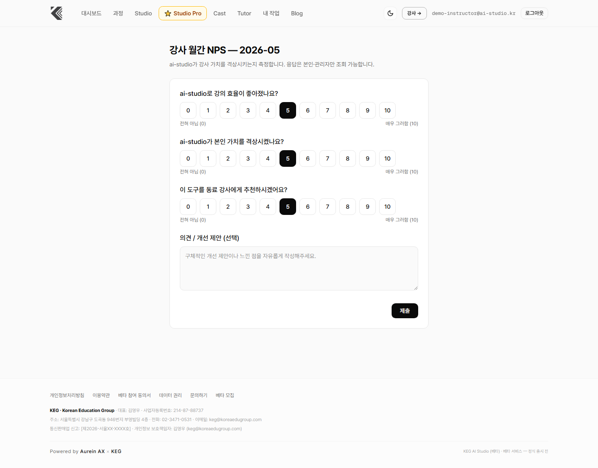

**구성**
- 분기별 NPS 점수 (Promoter % - Detractor %)
- 학습자 자유 의견 모음
- 추세 차트 (직전 4분기)

**기능 포인트**
- `instructor_nps` 집계 — 0-10점 척도
- 9-10 = Promoter, 0-6 = Detractor
- NPS < 30 알림 → 강사 코칭 트리거

---

## C-8. 강사 교육 (`/instructor/training`)
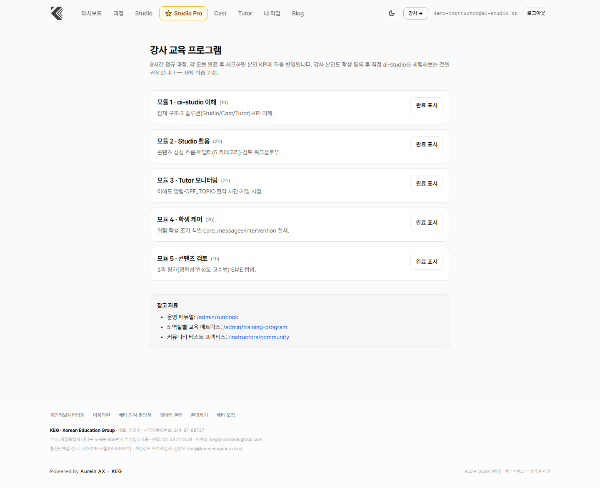

**모듈**
1. **플랫폼 사용법** — Studio/Cast/Studio Pro 기본
2. **AI 콘텐츠 품질 가이드** — 정확성·편향 회피·저작권
3. **학습자 케어** — 튜터 알림 응대법
4. **고급 활용** — RAG 인덱싱, 음성 클로닝

**기능 포인트**
- 모듈별 완료 시 `instructor_training_progress` 기록
- 전체 완료 = "Verified Instructor" 배지 부여

---

## C-9. 주간 리포트 (`/instructor/weekly-report`)
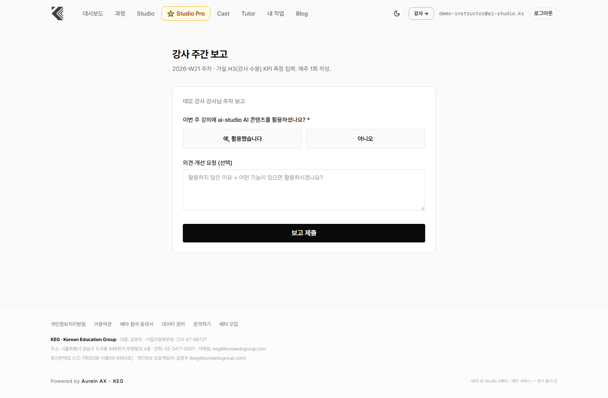

**주간 자동 생성 항목**
- 본인 강의 시청 시간 (학습자 합산)
- 신규 등록 학습자 수
- 평균 이해도 (튜터 기반)
- 신고 / 콘텐츠 수정 요청 건수
- 인센티브 정산 예상액

**기능 포인트**
- 매주 월요일 06:00 KST 자동 생성 → 이메일 전송 (Resend)
- 강사가 본인 페이스를 빠르게 점검할 수 있는 단일 페이지

---

# D. 운영자 (`demo-ops@ai-studio.kr`, admin 권한)

## D-1. 운영팀 대시보드 (`/operations/dashboard`)
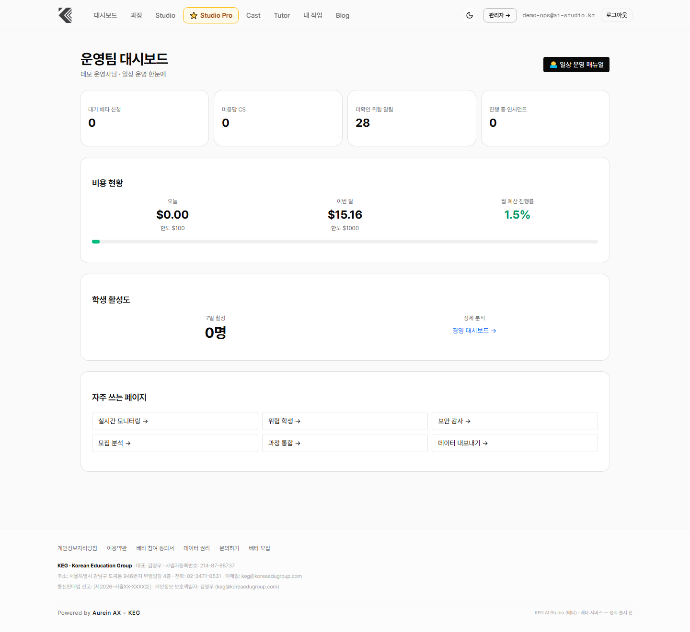

**핵심 KPI 4개**
- 대기 베타 신청 수
- 미응답 CS 건수
- 미확인 위험 알림 (예: 학습 이탈 위험)
- 진행 중 인시던트

**서브 섹션**
- **비용 현황** — 오늘 / 이번 달 / 월 예산 진행률
- **학생 활성도** — 7일 활성 학생 수
- **자주 쓰는 페이지** — 빠른 진입 링크 6종

---

## D-2. 위험 학습자 (`/admin/at-risk-students`)
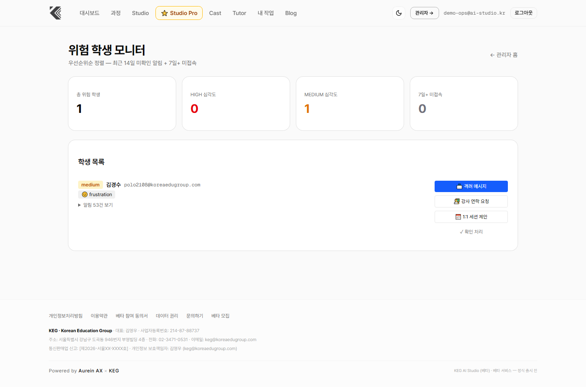

**기준**
- 7일간 로그인 없음
- 이해도 < 50% (튜터 기반)
- 과제 미제출 2회 연속

**메뉴**
- 위험 학생 리스트 + 위험 점수 (0-100)
- "케어 메시지 발송" 버튼 → Resend 이메일

**기능 포인트**
- `kpi_metrics` + `tutor_understanding_alerts` 조인 결과
- 발송된 메시지는 `care_messages_log` 기록 → 효과 추적

---

## D-3. 이메일 로그 (`/admin/email-log`)
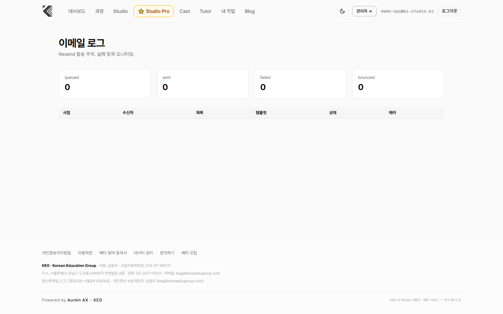

**컬럼**
- 수신자, 제목, 템플릿, 상태(queued/sent/failed), 발송 시각, 오류

**메뉴**
- 상태별 필터 / 템플릿별 필터
- 실패 항목 클릭 → 재발송 시도

**기능 포인트**
- 모든 시스템 이메일 (인증, 알림, 케어, 청구) 일관 추적
- Resend API 응답 ID(`resend_id`) 저장 → Resend 대시보드 역추적 가능

---

## D-4. 모니터링 (`/admin/monitoring`)
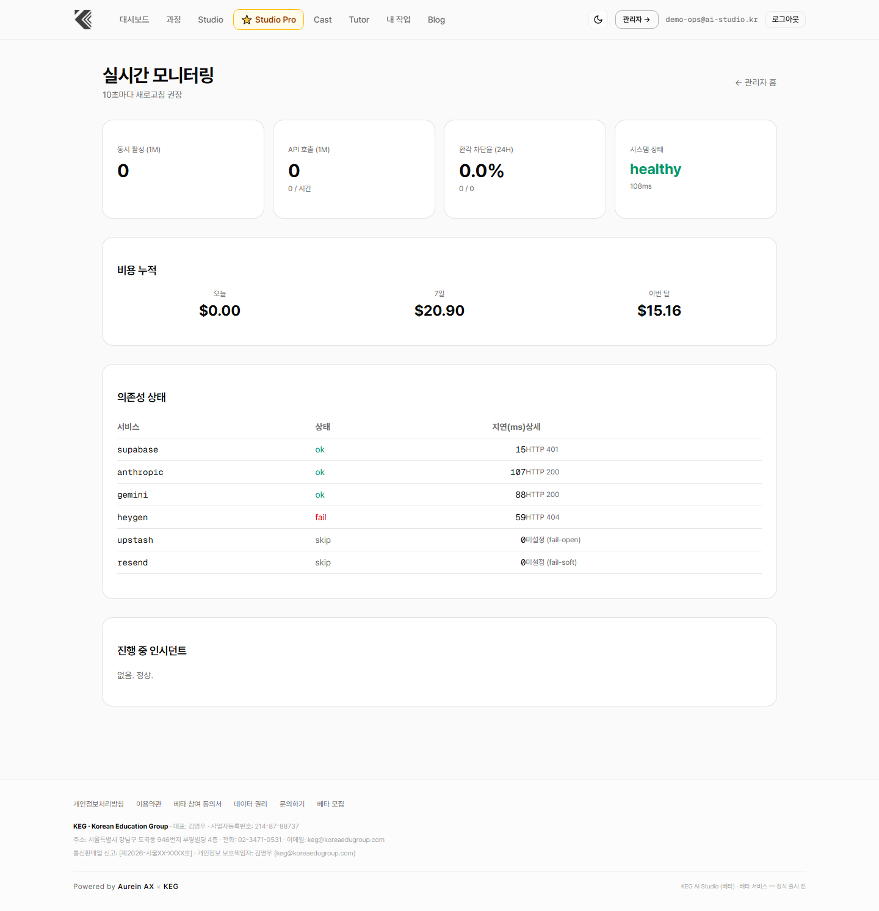

**위젯**
- **시스템 상태** — DB / Storage / Stripe / Resend 헬스
- **최근 1시간 트래픽** — 페이지뷰, API 호출, 에러율
- **상위 비용 작업** — 최근 24시간 가장 비싼 Studio/Cast 작업 Top 10
- **알림 보드** — `admin_alerts` 미확인 항목

**기능 포인트**
- `/api/admin/db-check` 호출로 마이그레이션 0001~0050 적용 여부 1회 검증

---

## D-5. 콘텐츠 조치 큐 (`/admin/remediation`)
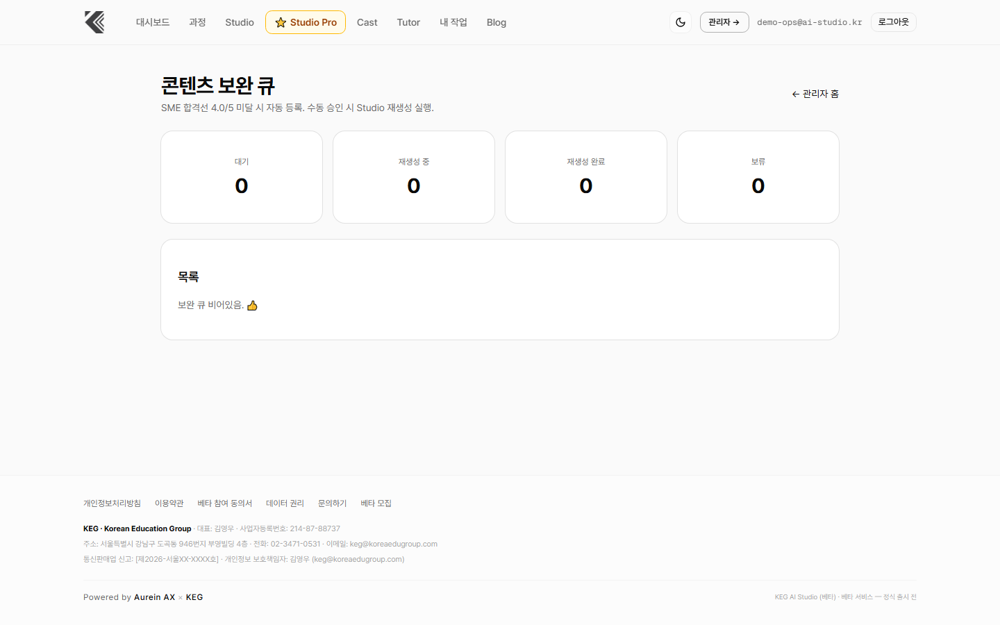

**큐 흐름**
1. 학습자 신고 (`content_reports`) → 검토 대기
2. 검토 → 조치 결정 (수정 요청 / 비공개 / 삭제 / 조치 없음)
3. 결정 → `content_remediation_queue`에 작업 생성
4. 작업 처리 → 강사 통보 + 콘텐츠 업데이트

**기능 포인트**
- 신고-조치 시간 SLA 24시간 기준 추적
- 반복 신고된 콘텐츠 자동 강조 표시

---

## D-6. 런북 (`/admin/runbook`)
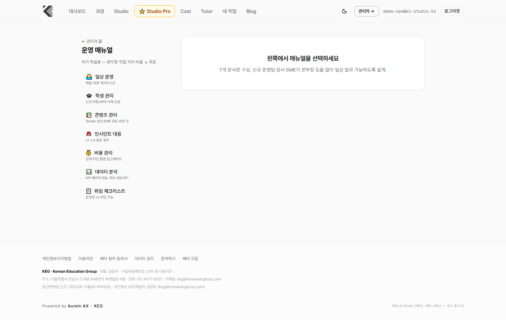

**섹션**
- 시스템 장애 대응 절차
- 사용자 케어 표준 응대 템플릿
- 비용 한도 초과 시 조치 흐름
- 데이터 삭제 요청 처리 절차 (GDPR/개인정보보호법)

**기능 포인트**
- 운영자 신규 입사자가 첫 주 학습할 표준 가이드
- 마크다운으로 작성되어 검색 가능

---

## D-7. 수강생 관리 (`/admin/students`)


**컬럼**
- 이름, 이메일, 가입일, 학습 이력, 이해도 평균, 마지막 활동, 위험 점수

**메뉴 (v2.3.0 인프라 적용 대상)**
- 검색 — SearchFilter 컴포넌트 (이름·이메일)
- 일괄 작업 — BulkActionBar (메일 발송 / 비활성화 / 케어 메시지)
- CSV 내보내기 — `lib/csv.ts` 유틸 (UTF-8 BOM, Excel 호환)

**기능 포인트**
- 학생 한 명 클릭 → 상세 페이지 (학습 이력, 결제 내역, 동의서, 티켓 이력 통합)
- 개인정보 삭제 요청 처리 — `/admin/anonymize-data`로 이관

---

# E. 시연 시나리오 (15분)

| 분 | 화면 | 보여줄 포인트 |
|---|---|---|
| 0-1 | 메인 + 로그인 | 매직링크/비밀번호 양방향, role 기반 자동 라우팅 |
| 1-4 | 강사 → Studio | 주제 한 줄 → 13개 에이전트가 책 한 권 5분에 생성 |
| 4-6 | 강사 → Cast | PPT 1장 → 7개 에이전트 파이프라인으로 영상 완성 |
| 6-7 | 강사 → Studio Pro | 강사 자료 업로드 → 강사 스타일 RAG 학습 |
| 7-9 | 수강생 → AI 튜터 | 9개 에이전트 + 이해도 자동 측정 → 운영자 알림 자동 |
| 9-11 | 수강생 → 코스/온보딩 | 카탈로그 + 5단계 온보딩 + 동의 관리 |
| 11-13 | 운영자 → 위험학습자/이메일로그/모니터링 | 고객 성공 자동화 + 비용 모니터링 |
| 13-15 | 운영자 → 콘텐츠 조치 / 수강생 관리 | 신고 SLA + CSV 내보내기 + 일괄 작업 |

---

# F. 데모 환경 운영 명령어

```bash
cd 04-projects/ai-studio-app/apps/web

# 1) 데모 계정 비밀번호·role 재설정 (idempotent)
npm run seed:demo

# 2) 더미 데이터 시드 (코스/티켓/신고/Studio 샘플)
npm run seed:demo-data

# 3) 모든 페이지 스크린샷 갱신
BASE_URL=https://ai-studio-drab-nine.vercel.app npm run capture

# 4) PPT 재빌드
npm run manual:pptx

# 시연 종료 후 정리
npx tsx scripts/seed-demo-data.ts --cleanup
npx tsx scripts/seed-demo-users.ts --cleanup
```

---

# G. 알려진 한계 (시연 시 양해)

- **ai-studio.kr 도메인**은 Netlify 잔존(404) — 실제 라이브는 `ai-studio-drab-nine.vercel.app`. DNS 전환 필요.
- **데모 운영자 권한** — 시연 편의를 위해 admin 권한 부여. 실제 운영 환경에서는 `operations` role + `is_admin_or_ops()` 헬퍼 기반 제한 접근.
- **Studio·Cast·튜터 실제 호출** — 30초~수 분 소요. 시연은 미리 완료된 결과로 보여주는 게 안전.
- **admin_alerts.message 컬럼 없음** — 마이그레이션 0015에서 컬럼명 `alert_message`로 정의됨. 시드 스크립트 무해 경고.
- **비밀번호 `rlarudtn2!`** 는 약함. 시연 종료 즉시 cleanup 권장.
